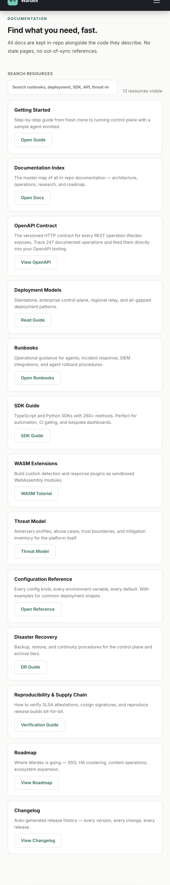
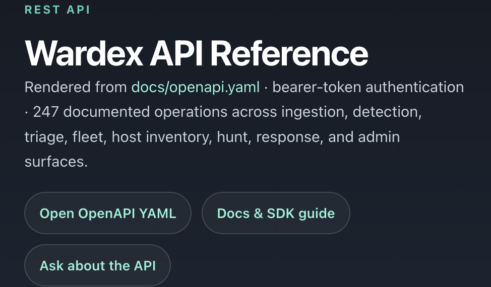

# Wardex

[](https://minh.systems/Wardex/)
[](https://github.com/sponsors/pinkysworld)
[](https://github.com/pinkysworld/Wardex/releases)

Wardex (`pinkysworld/Wardex`) is a Rust-based XDR and SIEM platform for private-cloud and self-hosted security operations. It brings telemetry collection, detection engineering, malware analysis, analyst workflows, approval-gated response, fleet management, evidence handling, and release verification into one deployable product.

## Why Wardex

- **Own the control plane:** run the console, APIs, telemetry, and evidence workflows in your own environment.
- **Investigate in one place:** triage alerts, inspect threads/processes, pivot into cases, and keep source evidence attached.
- **Respond with guardrails:** use approval-aware actions such as block IP, isolate host, kill process, quarantine file, disable account, and rollback.
- **Scan across platforms:** malware, virus, trojan, and rootkit workflows cover Linux, macOS, and Windows with local engines plus optional open-source signature presets.
- **Ship verifiably:** releases include checksums, SBOMs, provenance, signed artifacts, and documented verification gates.

## Unreleased

Work merged since `v1.0.30` and not yet released:

- **Real Tantivy-backed search** replacing the previous in-memory re-scan (`/api/search`, `/api/hunt`).
- **Real kernel telemetry**: Linux (`CN_PROC` netlink process events, `fanotify`/`inotify` file activity — eBPF is not implemented), a Windows ETW consumer (requires elevation), and a macOS Endpoint Security client behind the opt-in `macos-es` feature (requires an Apple `endpoint-security` entitlement, not exercised in CI).
- **Real `.yar` rule compiler** for a documented subset of YARA syntax, alongside the existing JSON rule format.
- **Real Random Forest triage training** (CART trees, bootstrap + out-of-bag evaluation) from analyst-labelled alert feedback.
- **Federated learning with differential privacy**: a coordinator/participant protocol for cross-agent federated averaging, with per-round gradient clipping and calibrated Gaussian noise.
- **WASM extension runtime** (`wasmi`, fuel-metered, no JIT) for sandboxed third-party extensions with a versioned host ABI.
- **Threat-intel enrichment**: VirusTotal and AbuseIPDB clients for hash/IP/domain/URL lookups.
- **Bidirectional ticketing**: Jira and ServiceNow REST clients with idempotent create-or-update sync.
- **OTLP export, SMTP STARTTLS, and Okta polling** integrations.
- **Live Docker/Podman and Kubernetes container event sources**, including a best-effort in-cluster Kubernetes watch (documented as TLS-trust-limited pending a custom CA anchor).
- **Previously documented-but-missing config keys implemented**, including `[collection]`, `[detection]`, `[collectors]`, `[relay]`, and `[attestation]`.
- **Dependency and security updates**: `rustls` bumped for `RUSTSEC-2026-0285`, plus major-version upgrades to `rand`, `ed25519-dalek`, `aes-gcm`, and `toml`.
- **Admin console redesign**: topbar/navigation chrome cleanup and a shared icon set.

See [CHANGELOG.md](CHANGELOG.md#unreleased) for full details.

## Current Release: `v1.0.30`

This release is a persistence-consolidation and reliability patch: every embedded store now persists to a durable SQLite `.db` file (migrating legacy JSON in place on first load), the dependency surface is refreshed, and several correctness edges in enforcement and server startup are hardened.

- **SQLite persistence consolidation** — case, agent-registry, session, and event stores now persist to per-store SQLite `.db` files with WAL journaling and transactions, replacing the previous JSON snapshots; existing JSON state is migrated automatically on first load.
- **Enforcement correctness** — the Windows process-signal path issues a real `taskkill /F /PID` for KILL and returns honest errors for unsupported STOP/CONT instead of reporting a fake success.
- **Server startup hardening** — the listener bind path removes a TOCTOU race by keeping the bound socket instead of binding, dropping, and rebinding.
- **Dependency and CI refresh** — `rusqlite 0.40`, `tower-http 0.7`, and a batch of patch/minor bumps are applied; the container build tracks the pinned `1.95` toolchain and previously soft-failed CI gates now run as hard gates.

See [CHANGELOG.md](CHANGELOG.md) for full release history.

## Quick Start

Install frontend dependencies and build the Rust binary:

```bash
npm ci --prefix admin-console
cargo build --release
```

Start Wardex:

```bash
./target/release/wardex start
```

Read the generated admin token:

```bash
cat var/.wardex_token
```

Open the console:

```text
http://localhost:8080/admin/
```

Notes:

- `http://localhost:8080/` serves the product website.
- `http://localhost:8080/admin/` serves the authenticated admin console.
- If `WARDEX_ADMIN_TOKEN` is set, Wardex uses that token and may not create `var/.wardex_token`.
- Check the running version with `./target/release/wardex --version`.
- Export machine-readable diagnostics with `./target/release/wardex doctor --json`.

Useful local commands:

```bash
cargo run -- demo
cargo run -- analyze examples/credential_storm.csv
cargo run
WARDEX_ADMIN_TOKEN="$(cat var/.wardex_token)" bash scripts/evaluate_to_value.sh
```

The evaluation script exercises the 15-minute path with evaluation-only seeded proof data: readiness, first-run proof seeding, first alert, response dry-run, evidence export, and deployment trust reporting. The exported artifacts land in `output/evaluate-to-value/`.

## Core Capabilities

- **Telemetry and monitoring:** OS event streams, process trees, file/network activity, kernel-event normalization, and live control-plane views.
- **Detection engineering:** managed Sigma/native rules, YARA content, MITRE ATT&CK coverage, suppressions, replay validation, promotion/rollback, and saved hunts.
- **Malware analysis:** hash and YARA matching, static and behavior profiles, quarantine guidance, open-source signature presets, and on-demand scans.
- **SOC workflows:** alert queue, cases, investigations, notes, timelines, evidence bundles, handoffs, response approvals, and analyst assistant pivots.
- **Response automation:** playbooks, approval gates, platform-aware remediation actions, rollback evidence, and audit history.
- **Fleet operations:** agent enrollment, heartbeat tracking, policy sync, rollout assignment, rollback, recovery focus, and inventory context.
- **Governance:** RBAC, HttpOnly admin sessions, audit chain, retention controls, encrypted evidence buffering, compliance exports, and support bundles.
- **Integrations:** SIEM export, OCSF normalization, live threat-intel feed ingestion (MalwareBazaar, URLhaus, Feodo Tracker), ticket sync, OpenTelemetry, GraphQL, REST OpenAPI, and generated SDKs.

## Documentation

Start here:

- [Getting Started](docs/GETTING_STARTED.md)
- [Evaluate Wardex in 15 Minutes](docs/EVALUATE_WARDEX.md)
- [Architecture](docs/ARCHITECTURE.md)
- [Status](docs/STATUS.md)
- [Compatibility](docs/COMPATIBILITY.md)
- [Release Acceptance](docs/RELEASE_ACCEPTANCE.md)
- [Runbooks](docs/runbooks/README.md)
- [Operate Wardex](docs/OPERATE_WARDEX.md)
- [Install/Upgrade](docs/INSTALL_UPGRADE.md)
- [Troubleshoot](docs/TROUBLESHOOT.md)
- [SDK Guide](docs/SDK_GUIDE.md)
- [OpenAPI Contract](docs/openapi.yaml)

The public website lives in [site/](site/) and mirrors the main product, release, and support information.

## Documentation Surfaces

The GitHub docs and the public website now share the same `v1.0.30` release surface for operator guides and API reference.





## Development and Verification

Common checks:

```bash
cargo test
cargo build --release
make smoke
npm run build --prefix admin-console
python3 scripts/validate_release_docs.py
make release-acceptance
```

Focused frontend checks can be run from `admin-console/` with Vitest or Playwright, depending on the workflow being changed.

## Releases and Trust

Tagged releases are packaged by GitHub Actions for Linux, macOS, and Windows. The release pipeline publishes checksums, CycloneDX SBOMs, SLSA provenance, cosign signatures, and notarized macOS archives when the required signing secrets are present.

Local signed macOS builds require Developer ID signing and notarization credentials. Unsigned local builds are still useful for development and verification, but tagged CI releases are the distribution path for signed artifacts.

## Repository Layout

```text
src/                  Rust control plane, detection, scanning, response, and API modules
admin-console/        React admin console embedded into release builds
site/                 Static product website
docs/                 Product docs, runbooks, status, architecture, and release guidance
sdk/                  Generated Python and TypeScript SDKs
deploy/               Helm, OTLP, container, signing, and deployment assets
tests/                Integration, live, and browser smoke coverage
examples/             Sample telemetry and demo scenarios
.github/workflows/    CI, Pages, release, signing, and publishing automation
```

## License and Support

Wardex is dual-licensed:

- **Open source:** [AGPL-3.0](LICENSE)
- **Commercial:** [commercial license](LICENSE.COMMERCIAL) for organizations that cannot use AGPL network-service copyleft terms

Support details are available on the [Wardex support page](https://minh.systems/Wardex/support/) and through [GitHub Sponsors](https://github.com/sponsors/pinkysworld).

For production deployment, licensing, or operator support, contact support@wardex.dev. For responsible security disclosure, email security@wardex.dev or use the private GitHub advisory flow.
