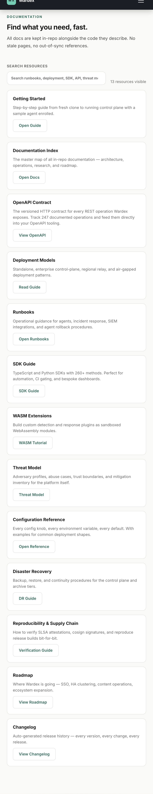
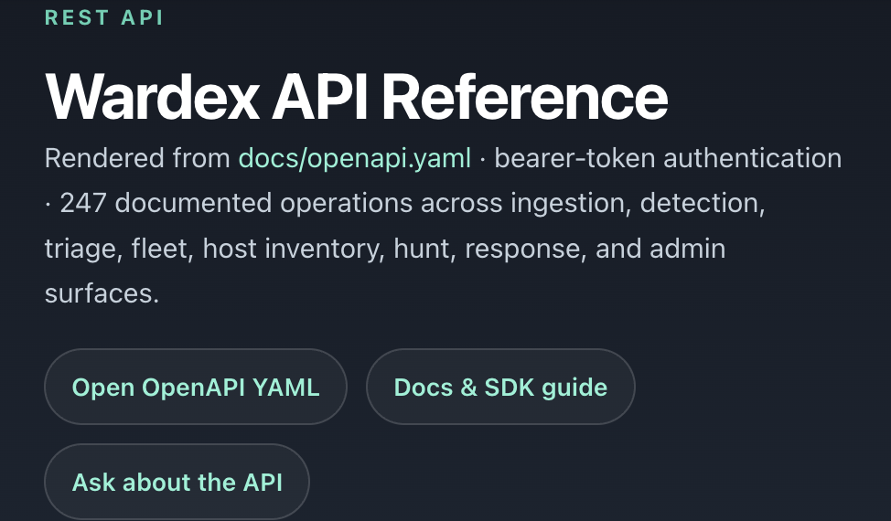

# Wardex Documentation

This folder tracks the current shipping product, not just the historical implementation journey.
Wardex is the product, runtime, and control-plane implementation in this repository.

Read it in this order:

1. [`GETTING_STARTED.md`](GETTING_STARTED.md) for local build, test, and control-plane startup.
2. [`ARCHITECTURE.md`](ARCHITECTURE.md) for the platform pipeline and major subsystems.
3. [`STATUS.md`](STATUS.md) for the current release posture, verification snapshot, and shipped enterprise capabilities.
4. [`DEPLOYMENT_MODELS.md`](DEPLOYMENT_MODELS.md) and [`PRODUCTION_HARDENING.md`](PRODUCTION_HARDENING.md) for deployment and operational readiness.
5. [`runbooks/README.md`](runbooks/README.md) for operator playbooks and integration guidance.
6. [`ROADMAP_XDR_PROFESSIONAL.md`](ROADMAP_XDR_PROFESSIONAL.md) for post-release priorities.

## Live docs surfaces

- Website docs hub: [`site/resources.html`](../site/resources.html)
- Website API reference: [`site/api.html`](../site/api.html)

## Topic index

### Operating the product

- [`CONFIGURATION.md`](CONFIGURATION.md) — configuration surface, `wardex.toml`, environment variables
- [`DEPLOYMENT_MODELS.md`](DEPLOYMENT_MODELS.md) — single-node, HA, air-gapped
- [`PRODUCTION_HARDENING.md`](PRODUCTION_HARDENING.md) — TLS, auth, rate limits, system tuning
- [`SLO_POLICY.md`](SLO_POLICY.md) — service-level objectives and error budget
- [`DISASTER_RECOVERY.md`](DISASTER_RECOVERY.md) — backup and restore planning
- [`FEATURE_FLAGS.md`](FEATURE_FLAGS.md) — runtime feature toggles
- [`runbooks/`](runbooks/) — agent, SIEM, and response runbooks (incl. [`AGENT_ROLLBACK.md`](runbooks/AGENT_ROLLBACK.md))

### Security & supply chain

- [`THREAT_MODEL.md`](THREAT_MODEL.md) — trust boundaries and abuse cases
- [`REPRODUCIBILITY.md`](REPRODUCIBILITY.md) — verify release artifacts via `gh attestation verify` and cosign
- [`DESIGN_SUPPLY_CHAIN.md`](DESIGN_SUPPLY_CHAIN.md) — supply-chain architecture
- [`DESIGN_POST_QUANTUM.md`](DESIGN_POST_QUANTUM.md) — PQC migration plan

### Contract & schema

- live HTTP API contract: [`/api/openapi.json`](/api/openapi.json) on a running server
- [`openapi.yaml`](openapi.yaml) — legacy reference snapshot kept for historical context
- [`SCHEMA_LIFECYCLE.md`](SCHEMA_LIFECYCLE.md) — compatibility and schema evolution policy
- [`SDK_GUIDE.md`](SDK_GUIDE.md) — Python and TypeScript SDK usage

### Research & design

- [`RESEARCH_TRACKS.md`](RESEARCH_TRACKS.md) — active research agenda
- [`RESEARCH_QUESTIONS_R26_R30.md`](RESEARCH_QUESTIONS_R26_R30.md), [`R31_R35`](RESEARCH_QUESTIONS_R31_R35.md), [`R36_R40`](RESEARCH_QUESTIONS_R36_R40.md)
- `DESIGN_*.md` — per-subsystem design notes (adversarial harness, digital twin, policy composition, swarm, temporal logic, WASM, …)
- [`PAPER_TARGETS.md`](PAPER_TARGETS.md) — academic publication targets
- [`WASM_TUTORIAL.md`](WASM_TUTORIAL.md) — WASM extension tutorial

### Planning

- [`PROJECT_BACKLOG.md`](PROJECT_BACKLOG.md)
- [`IMPLEMENTATION_PLAN.md`](IMPLEMENTATION_PLAN.md)
- [`ROADMAP_XDR_PROFESSIONAL.md`](ROADMAP_XDR_PROFESSIONAL.md)

## Working rule

- update docs when operator-visible behavior changes
- keep counts, versions, and release posture accurate
- treat the website, README, and docs as one release surface
